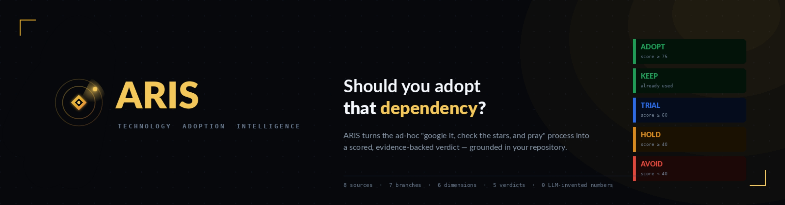

<div align="center">



<h3>Should you adopt that dependency? ARIS turns that question into a scored, evidence-backed verdict — grounded in your repository.</h3>

<p>
<a href="https://aris.eshita.dev"></a>


</p>

<p>
<a href="https://aris.eshita.dev"><b>Try it live →</b></a>
</p>

<p>
<a href="#what-you-get">What you get</a> &nbsp;&middot;&nbsp;
<a href="#why-aris-is-different">Why it&#39;s different</a> &nbsp;&middot;&nbsp;
<a href="#how-it-works">How it works</a> &nbsp;&middot;&nbsp;
<a href="#the-score">The score</a> &nbsp;&middot;&nbsp;
<a href="#run-it">Run it</a> &nbsp;&middot;&nbsp;
<a href="#roadmap">Roadmap</a>
</p>

</div>

---

**ARIS** evaluates a software tool or library and produces an **Adoption Decision Brief** — a 0–100 score across six dimensions, a single verdict (**ADOPT / KEEP / TRIAL / HOLD / AVOID**), narrative reasoning grounded in *your* repository, alternatives shaped by your use case, and an honest confidence figure — delivered to your inbox as a formatted email.

It replaces the ad-hoc *"google it, check the stars, and hope"* process teams fall back on when deciding whether to take on a dependency.

> **The one idea that matters:** LLMs read prose and write prose. **Every number comes from deterministic Python** — no model ever invents a score. That single constraint is what makes every figure in the brief auditable.

> **The second idea that matters:** A generic brief is a lame brief. ARIS reads *your* repository's manifest, README, and structure — then writes commentary specific to your codebase. If you already use a competing tool, ARIS detects it. If the tool is already a declared dependency, ARIS reframes the verdict as KEEP, not ADOPT.

<table>
<tr>
<td><b>8</b><br>data sources fused</td>
<td><b>7</b><br>parallel branches</td>
<td><b>6</b><br>weighted dimensions</td>
<td><b>5</b><br>verdict labels</td>
<td><b>0</b><br>LLM-invented numbers</td>
</tr>
</table>

---

## What you get


A one-look brief: the **verdict badge** with weighted score and confidence, **six dimension scores** with one-line narratives, a **terminal-style repo scan** (archetype, key libraries, existing competitors, migration effort), an **engineer's take** — a personalised commentary block written about *your* specific codebase — a **recommendation rationale** (why this verdict, and what would move it up or down), **alternatives** chosen for your stated use case, and a **caveats** section that states plainly what evidence was thin. Shipped as a branded HTML email.

The brief contains five layers, in this order:

1. **Verdict tile** — one of five labels, the weighted score, and a confidence figure.
2. **Quick-scan KPI strip** — stack fit, security, maintenance, production adoption.
3. **Repo scan block** — terminal-style readout of what ARIS found in your codebase: archetype, declared libraries, any detected competitors, migration effort signal.
4. **Engineer's take** — a pull-quoted commentary, written after reading your README and manifest, that names what would have to change for the tool to fit.
5. **Dimension scores with narratives** — six metrics, each with a one-or-two-sentence explanation that cites concrete facts.

---

## Why ARIS is different

- **Deterministic scoring, LLM commentary.** No LLM ever produces a score. Numbers come from Python with documented formulas; LLMs only turn web prose into structured findings and write the narrative.
- **Repo-aware reasoning.** ARIS scans your repository's manifests (`pyproject.toml`, `requirements.txt`, `package.json`, etc.), README, language stats, and top-level structure — then writes commentary that names your actual stack. Generic "this is a Python package with N dependencies" briefs do not pass our acceptance criteria.
- **Competitor detection.** A built-in tool-category map identifies when a tool you're considering competes with something already in your repo. Evaluating Qdrant against a repo that already declares FAISS is a *migration* decision, not a *greenfield* one — and the brief frames it that way.
- **Verdict-aware framing.** When the tool is already declared in your repo, the verdict is `KEEP`, not `ADOPT`. The brief reframes around upgrade safety and version-ceiling risk, not a fresh adoption pitch.
- **Honest confidence.** Missing data lowers *confidence*, not the *score*. A tool can score well at low confidence — a fundamentally different signal from scoring poorly at high confidence.
- **Security = live surface, not history.** The security score counts only **unpatched** CVEs — the real attack surface on a current release — not a tool's entire disclosure history (which unfairly punishes popular, well-audited libraries).
- **A fixed DAG, not an autonomous agent.** The graph is decided at design time, so the same input runs the same path. Predictable, explainable, reproducible — the right properties for decision support.

---

## How it works


Input → decompose → **seven parallel intelligence branches** → compress → score → synthesize → deliver. Blue nodes are LLM/agent (text in, structure out); gold nodes are deterministic Python (all scoring and counting).

| Branch | Source | Engine | Produces |
|---|---|---|---|
| Community Sentiment | Tavily | LLM | friction & enthusiasm signals; docs / setup / debugging proxies |
| Production Adoption | Tavily + GitHub + Stack Overflow + deps | LLM + Python | named enterprises, stars, SO, dependents → a combined production score |
| Alternatives | Tavily | LLM | ranked alternatives, migration stories, win / lose conditions |
| Security Risk | OSV.dev | Python | unpatched CVE severity breakdown, vulnerability patterns |
| Download Trajectory | PyPI / npm (+ Tavily) | LLM | velocity: accelerating / stable / declining |
| GitHub Health | GitHub API | Python | commit velocity, bus factor, issue health, release cadence, failure prediction |
| **Stack Compatibility** | GitHub API (your repo's manifests + README + tree + languages) | Python + LLM | archetype detection, declared-dep parsing, **competitor detection** via tool-category map, repo profile, **personalised engineer commentary**, and a verdict label specific to your repo (`ALREADY_USED` / `MIGRATION_REQUIRED` / `FIT` / `POOR_FIT`) |

Every branch has retries and routes failures to a shared error handler — a branch that drops out simply **lowers confidence** rather than corrupting the score.

> **Engineering note — a custom node in the engine.** ARIS runs on a self-hosted **fork of Heym**. Two problems pushed me to extend the engine itself: its agent node couldn't execute scoring code inline, and several nodes flooded the model with so much raw API / MCP context that generation failed. So I added a custom **`PythonExec`** node to the fork — deterministic Python that (1) computes every score and (2) extracts just the fields each LLM needs from large payloads before they reach it. That node is now the backbone of ARIS: all three scoring stages, every branch's data-extraction adapter, and the repo-profile bundler run on it.

### The Stack Compatibility branch in detail

This is the branch that makes the brief feel like a teammate wrote it instead of a search engine. It does five things:

1. **Manifest parsing** — fetches `pyproject.toml`, `requirements.txt`, `Pipfile`, `setup.cfg`, and `package.json` from your repo. Parses dependencies, optional-dependency groups (PEP 621), Poetry groups, and PEP 735 dependency-groups. Canonicalises package names per PEP 503.
2. **Repo profiling** — pulls the README excerpt, GitHub language stats, top-level directory listing, and repo metadata (stars, description, topics). Detects the project's **archetype**: `library`, `web_service`, `ml_pipeline`, `ml_research`, `data_pipeline`, `cli`, or `infra`.
3. **Competitor detection** — a maintained category map (`vector_db`, `orm`, `web_framework`, `queue`, `dataframe`, `llm_framework`, ...) identifies tools that compete with the one you're evaluating. If `polars` is being evaluated and `pandas` is already declared, that's flagged as an existing competitor.
4. **Personalised commentary** — a dedicated LLM node receives the manifest, README, archetype, and competitor list. It produces a structured commentary: what the repo currently does for this problem, what would change, concrete integration concerns, migration effort signal (`low`/`medium`/`high`/`not_applicable`), a 4-6 sentence personal commentary in an engineer's voice, and a verdict-for-this-repo label.
5. **Score and override** — the deterministic score reflects ecosystem fit; the verdict-for-this-repo label overrides the final recommendation band when appropriate (`ALREADY_USED` → `KEEP`, `POOR_FIT` → `AVOID`).

The output is bundled and passed *directly* to the synthesizer alongside the compressed external findings — so the brief always cites concrete facts about your codebase.

---

## The score

Six weighted dimensions, each 0–100. Every weight is a named, commented constant — a documented heuristic, not a number buried in a formula.

| Dimension | Weight | How it is computed |
|---|:--:|---|
| Maintenance Health | 20% | GitHub: commit velocity, contributors, issue close-rate, release cadence, bus factor |
| Security Risk | 20% | OSV, **unpatched only**: `100 − 20×critical − 10×high − age penalty` |
| Stack Compatibility | 20% | Target-repo manifest match + competitor detection + archetype fit |
| Ecosystem Maturity | 15% | download momentum + production score + alternatives count |
| Production Adoption | 15% | case studies + GitHub stars + Stack Overflow + dependents (+ first-party boost if `ALREADY_USED`) |
| Learning Curve | 10% | docs, tutorials, setup, API surface, debugging friction |

### Verdict bands

| Verdict | When | Color |
|---|---|---|
| **ADOPT** | Weighted score ≥ 75 and no repo-level signal against it | Green |
| **KEEP** | Tool is already a declared dependency in your repo (`repo_verdict == ALREADY_USED`) | Green |
| **TRIAL** | Weighted score ≥ 60 | Blue |
| **HOLD** | Weighted score ≥ 40, *or* security veto fires | Amber |
| **AVOID** | Weighted score < 40, *or* ecosystem mismatch detected (`repo_verdict == POOR_FIT`) | Red |

**Security veto** — a security score below `30` caps the verdict at **HOLD** regardless of the weighted total. Live attack surface overrides a strong average.

**First-party production boost** — when the tool is `ALREADY_USED` in your repo, ARIS treats your codebase as a verified production reference and adds a small boost to the production-adoption score. The rationale: external case studies sometimes miss what your own deployment proves.

**Confidence** — `0.50 × data-completeness + 0.30 × deterministic-coverage + 0.20 × agreement`, capped at `0.95`.

---

## Run it

The fastest path: open **[aris.eshita.dev](https://aris.eshita.dev)**, fill in the four fields, hit submit, check your inbox in about two minutes.

| Field | Example | Notes |
|---|---|---|
| `repo_or_tool` | `langchain` *or* a GitHub URL | the tool under evaluation |
| `evaluation_context` | `building a RAG pipeline in Python` | your actual use case — shapes every query |
| `your_repo_url` | `https://github.com/you/your-project` | activates repo-aware scoring + personalised commentary |
| `recipient_email` | `you@company.com` | where the brief is delivered |

If `your_repo_url` is omitted, ARIS still runs — it just falls back to a generic brief without the Stack Compatibility branch contribution, and confidence drops accordingly. The other five dimensions reweight to fill the gap.

### Self-host

ARIS is a Heym workflow. To run your own instance:

1. Clone this repo and a [Heym](https://github.com/heym-ai/heym) fork (or compatible engine).
2. Import the workflows from `workflows/main/main.json` and `workflows/branches/*.json` onto the Heym canvas.
3. Add **Heym credentials** (never inline): an **NVIDIA NIM** API key (LLM), a **Tavily** key (search), a **GitHub** token (repo data), and **SMTP** credentials (email). OSV, PyPI, and npm need no keys.
4. Enable Portal on the main workflow with a slug of your choice. Wire the static frontend in `web/` to `POST /api/portal/<slug>/execute/stream`.

---

## Deployment

The live site at `aris.eshita.dev` runs on a free-tier stack:

- **Frontend** → Cloudflare Pages (static, auto-deployed from this repo's `main` branch).
- **Backend** → Heym (FastAPI + Postgres in Docker), reachable publicly via a permanent Cloudflare Tunnel at `aris-api.eshita.dev`. No public IP, no port forwarding.
- **Auto-start** → Docker Desktop and `cloudflared` both start on Windows login via Task Scheduler. From cold boot to working public site takes ~90 seconds, hands-off.

A full build log, glossary of every term used, and troubleshooting notes are in [`HOSTING_NOTES.md`](HOSTING_NOTES.md).

---

## Design system

ARIS has its own visual identity — **"Verdict"**: a near-black canvas, a single metallic-gold accent used only as chrome, semantic verdict badges, terminal-style scan blocks for repo data, and monospaced numerals for every figure so the output reads like an instrument, not a marketing page. The brand carries across the email, the landing page, and this repo. Logo and tokens live in [`assets/`](assets/).

The email design merges two aesthetics deliberately: **dashboard** (KPI tiles, score gauges, color-coded metric bars) for at-a-glance scanning, and **terminal** (monospaced prompts, command-line output blocks, `// section headers`) to signal that this is an engineering tool — not a marketing report.

---

## Project structure

```
ARIS/
├── README.md
├── HOSTING_NOTES.md          deploy + ops reference (Cloudflare Tunnel, Pages, troubleshooting)
├── LICENSE
├── assets/                   logo, banner, architecture diagram, sample brief, brand marks
├── mail.html                 the email template the workflow renders into
├── web/
│   ├── index.html            landing page with live verdict simulator and submission form
│   └── favicon.svg
└── workflows/
    ├── main/main.json
    └── branches/
        ├── stack-compatibility-branch.json   archetype + competitor detection + personal commentary
        ├── github-branch.json
        ├── security-risk-branch.json
        ├── production-adoption-branch.json
        ├── community-sentiment-branch.json
        ├── alternative-branch.json
        └── trajectory-branch.json
```

The Heym workflow itself is maintained on the canvas; exported graphs in `workflows/` are reference copies — they should not be committed with real API keys inline.

---

## Roadmap

- [x] **Seven-branch architecture** — Community Sentiment, Production Adoption, Alternatives, Security Risk, Download Trajectory, GitHub Health, Stack Compatibility all run in parallel; a dropped branch lowers confidence, not the score.
- [x] **Stack Compatibility branch** — parses `requirements.txt`, `pyproject.toml`, `Pipfile`, `setup.cfg`, or `package.json` from the user's own repo; detects existing dependencies; scores ecosystem fit against the tool under evaluation.
- [x] **Repo profiling** — README excerpt, language stats, top-level structure, and archetype detection (`library` / `web_service` / `ml_pipeline` / `data_pipeline` / `cli` / `infra` / `ml_research`).
- [x] **Competitor detection** — built-in tool-category map identifies competing tools already declared in the target repo and reframes the brief as a migration decision when applicable.
- [x] **KEEP verdict** — when a tool is already declared, the brief reframes around staying healthy on the current version, not fresh adoption.
- [x] **Personalised engineer commentary** — dedicated LLM node produces a 4-6 sentence pull-quote commentary specific to the target repo, displayed in the email as a serif italic block.
- [x] **First-party production boost** — when a tool is already used in the target repo, the repo itself counts as a verified production reference.
- [x] **Deterministic scoring** — all six dimension scores computed in `pythonExec` Python nodes; LLMs receive scores and write narrative only.
- [x] **Dashboard + terminal email design** — KPI tiles, score gauges, terminal-style repo scan, engineer's-take pull-quote, color-coded dimension bars.
- [x] **Public deployment** — landing page on Cloudflare Pages, backend on a Cloudflare Tunnel, custom domain at `aris.eshita.dev`.
- [ ] **Validation run** — labelled set of tools (FastAPI / React / NumPy = healthy through a deprecated package to an abandoned one), with pairwise win-rate, band hit-rate, and Spearman ρ published in this README.
- [ ] **Reproducibility** — pin model + temperature 0, snapshot raw responses by input hash, per-tool cache.
- [ ] **Human-in-the-loop** gate before delivery.
- [ ] **Triggers** — webhook / Slack command / CI, and a multi-tool comparison mode.

---

## Contributing

Issues and ideas are welcome — open an issue describing the tool/edge case ARIS mis-scored and (if you can) the dimension at fault. Scoring weights and category maps live as documented constants in the workflow JSON and are meant to be calibrated against the validation set, not guessed.

## License

MIT — see [`LICENSE`](LICENSE).

## Acknowledgements

Built on a self-hosted fork of **Heym**. Data from **OSV.dev**, **Tavily**, the **GitHub API**, **PyPI**, and **npm**. Inference via **gpt-oss-120b** served by **NVIDIA NIM**.

<div align="center"><sub><b>ARIS</b> · Technology Adoption Intelligence · the color of careful judgment</sub></div>
