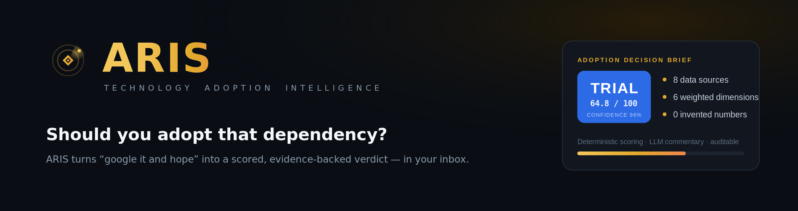
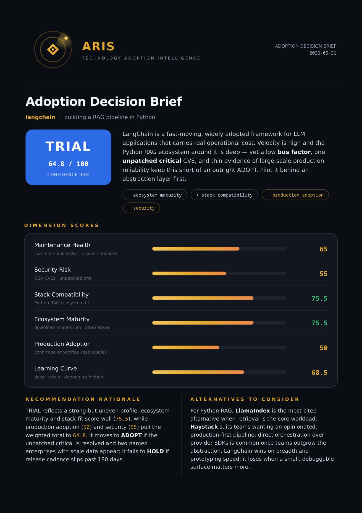
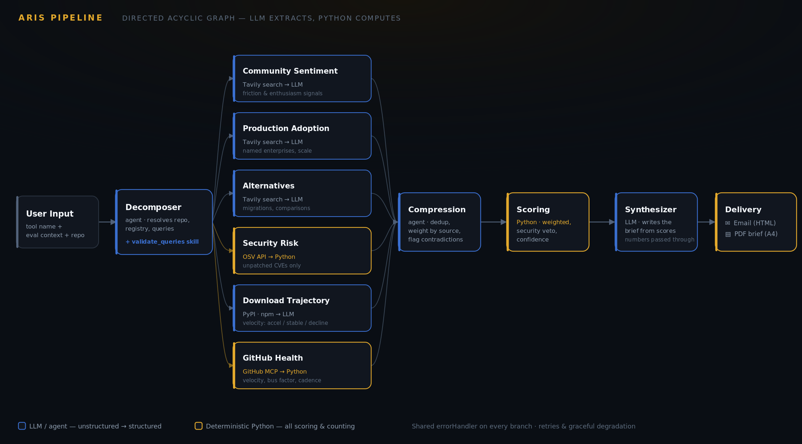

<div align="center">



<h3>Should you adopt that dependency? ARIS turns that question into a scored, evidence-backed verdict.</h3>

<p>


</p>

<p>
<a href="#what-you-get">What you get</a> &nbsp;&middot;&nbsp;
<a href="#why-aris-is-different">Why it&#39;s different</a> &nbsp;&middot;&nbsp;
<a href="#how-it-works">How it works</a> &nbsp;&middot;&nbsp;
<a href="#the-score">The score</a> &nbsp;&middot;&nbsp;
<a href="#validation">Validation</a> &nbsp;&middot;&nbsp;
<a href="#roadmap">Roadmap</a>
</p>

</div>

---

**ARIS** evaluates a software tool or library and produces an **Adoption Decision Brief** — a 0–100 score across six dimensions, a single verdict (**ADOPT / TRIAL / HOLD / AVOID**), narrative reasoning, alternatives for your specific use case, and an honest confidence figure — delivered to your inbox as a formatted email and PDF.

It replaces the ad-hoc *"google it, check the stars, and hope"* process teams fall back on when deciding whether to take on a dependency.

> **The one idea that matters:** LLMs read prose and write prose. **Every number comes from deterministic Python** — no model ever invents a score. That single constraint is what makes every figure in the brief auditable.

<table>
<tr>
<td><b>8</b><br>data sources fused</td>
<td><b>6</b><br>parallel branches</td>
<td><b>6</b><br>weighted dimensions</td>
<td><b>0</b><br>LLM-invented numbers</td>
</tr>
</table>

---

## What you get



A one-look brief: the **verdict badge** with weighted score and confidence, **six dimension scores** with one-line narratives, a **recommendation rationale** (why this verdict, and what would move it up or down), **alternatives** chosen for your stated use case, and a **caveats** section that states plainly what evidence was thin. Shipped as a branded HTML email and an A4 PDF.

---

## Why ARIS is different

- **Deterministic scoring, LLM commentary.** No LLM ever produces a score. Numbers come from Python with documented formulas; LLMs only turn web prose into structured findings and write the narrative.
- **Honest confidence.** Missing data lowers *confidence*, not the *score*. A tool can score well at low confidence — a fundamentally different signal from scoring poorly at high confidence.
- **Security = live surface, not history.** The security score counts only **unpatched** CVEs — the real attack surface on a current release — not a tool's entire disclosure history (which unfairly punishes popular, well-audited libraries).
- **A fixed DAG, not an autonomous agent.** The graph is decided at design time, so the same input runs the same path. Predictable, explainable, reproducible — the right properties for decision support.

---

## How it works



Input &rarr; decompose &rarr; **six parallel intelligence branches** &rarr; compress &rarr; score &rarr; synthesize &rarr; deliver. Blue nodes are LLM/agent (text in, structure out); gold nodes are deterministic Python (all scoring and counting).

| Branch | Source | Engine | Produces |
|---|---|---|---|
| Community Sentiment | Tavily | LLM | friction & enthusiasm signals; docs / setup / debugging proxies |
| Production Adoption | Tavily + GitHub + Stack Overflow + deps | LLM + Python | named enterprises, stars, SO, dependents → a combined production score |
| Alternatives | Tavily | LLM | ranked alternatives, migration stories, win / lose conditions |
| Security Risk | OSV.dev | Python | unpatched CVE severity breakdown, vulnerability patterns |
| Download Trajectory | PyPI / npm (+ Tavily) | LLM | velocity: accelerating / stable / declining |
| GitHub Health | GitHub API | Python | commit velocity, bus factor, issue health, release cadence, failure prediction |

Every branch has retries and routes failures to a shared error handler — a branch that drops out simply **lowers confidence** rather than corrupting the score.

> **Engineering note — a custom node in the engine.** ARIS runs on a self-hosted **fork of Heym**. Two problems pushed me to extend the engine itself: its agent node couldn't execute scoring code inline, and several nodes flooded the model with so much raw API / MCP context that generation failed. So I added a custom **`PythonExec`** node to the fork — deterministic Python that (1) computes every score and (2) extracts just the fields each LLM needs from large payloads before they reach it. That node is now the backbone of ARIS: all three scoring stages and every branch's data-extraction adapter run on it.

---

## The score

Six weighted dimensions, each 0–100. Every weight is a named, commented constant — a documented heuristic, not a number buried in a formula.

| Dimension | Weight | How it is computed |
|---|:--:|---|
| Maintenance Health | 20% | GitHub: commit velocity, contributors, issue close-rate, release cadence, bus factor |
| Security Risk | 20% | OSV, **unpatched only**: `100 − 20×critical − 10×high − age penalty` |
| Stack Compatibility | 20% | Target-repo dependency match (excluded until a repo is supplied) |
| Ecosystem Maturity | 15% | download momentum + production score + alternatives count |
| Production Adoption | 15% | case studies + GitHub stars + Stack Overflow + dependents |
| Learning Curve | 10% | docs, tutorials, setup, API surface, debugging friction |

**Verdict bands** &nbsp;`ADOPT ≥ 75` &nbsp;·&nbsp; `TRIAL ≥ 60` &nbsp;·&nbsp; `HOLD ≥ 40` &nbsp;·&nbsp; `AVOID < 40`

**Security veto** — a security score below `30` caps the verdict at **HOLD** regardless of the weighted total. Live attack surface overrides a strong average.

**Confidence** — `0.50 × data-completeness + 0.30 × deterministic-coverage + 0.20 × agreement`, capped at `0.95`.

---

## Validation

Heuristics are only as good as the evidence that they rank reality correctly. ARIS ships with a validation plan: run a labelled set of tools (FastAPI / React / NumPy = healthy → a deprecated package → an abandoned one = AVOID) through the workflow and prove the **ranking** holds.

- **Pairwise win-rate** ≥ 90%, with **zero** cases where a healthy tool scores below a known-bad one.
- **Band hit-rate** ≥ 70% exact, ≥ 90% within ±1 band.
- **Spearman ρ** ≥ 0.7 between ARIS's score and ground-truth health rank.

Full plan, the 15-tool set, edge cases, and a `score_validation.py` scorer: **[`docs/validation.md`](docs/validation.md)**.

---

## Run it

ARIS is a Heym workflow. Trigger the `userInput` node with:

| Field | Example | Notes |
|---|---|---|
| `repo_or_tool` | `langchain` *or* a GitHub URL | the tool under evaluation |
| `evaluation_context` | `building a RAG pipeline in Python` | your actual use case — shapes every query |
| `your_repo_url` | *(optional)* | enables real stack-compatibility scoring |
| `recipient_email` | `you@company.com` | where the brief is delivered |

**Configuration** — provide these as **Heym credentials**, never inline in nodes: an **NVIDIA NIM** API key (LLM), a **Tavily** key (search), a **GitHub** token (repo data), and **SMTP** credentials (email). OSV, PyPI, and npm need no keys.

---

## Design system

ARIS has its own visual identity — **"Verdict"**: a near-black canvas, a single metallic-gold accent used only as chrome, semantic verdict badges, and monospaced numerals for every figure so the output reads like an instrument, not a marketing page. The brand carries across the email, the PDF, and this repo. Logo and tokens live in [`assets/`](assets/).

---

## Project structure

```
ARIS/
├── README.md
├── LICENSE
├── assets/                 logo, banner, architecture diagram, sample brief, brand marks
└── docs/
    ├── validation.md       validation plan + score_validation.py
    └── sample-brief.pdf     a real Adoption Decision Brief (langchain)
```

The Heym workflow itself is maintained on the canvas; exported graphs are **not** committed here because they can embed API keys.

---

## Roadmap

- [ ] **Validation run** — the labelled set above, results published in this README.
- [ ] **Stack-compatibility branch** — parse the user's dependency manifest for real version/peer-conflict scoring.
- [ ] **Reproducibility** — pin model + temperature 0, snapshot raw responses by input hash, per-tool cache.
- [ ] **Human-in-the-loop** gate before delivery.
- [ ] **Triggers** — webhook / Slack command / CI, and a multi-tool comparison mode.
- [ ] **Frontend** — a small landing page and a hosted API.

---

## Contributing

Issues and ideas are welcome — open an issue describing the tool/edge case ARIS mis-scored and (if you can) the dimension at fault. Scoring weights live as documented constants and are meant to be calibrated against the validation set, not guessed.

## License

MIT — see [`LICENSE`](LICENSE).

## Acknowledgements

Built on a self-hosted fork of **Heym**. Data from **OSV.dev**, **Tavily**, the **GitHub API**, **PyPI**, and **npm**. Inference via **gpt-oss-120b** served by **NVIDIA NIM**.

<div align="center"><sub><b>ARIS</b> · Technology Adoption Intelligence · the color of careful judgment</sub></div>
